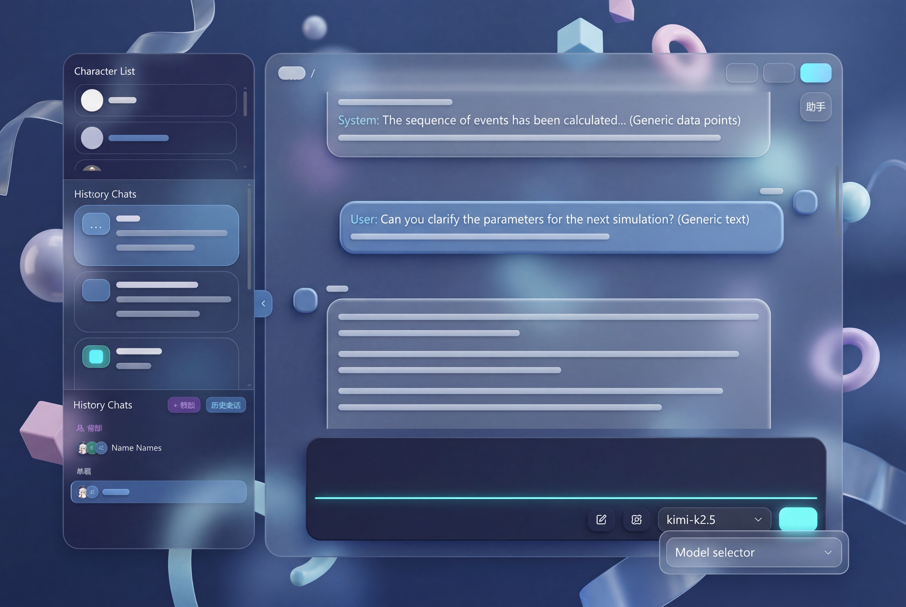

<div align="center">



<small>图像由AI 生成  界面参考</small>

**SimpleTavern**

本地单用户 AI 角色扮演应用。前端为 Vue 3 + Vite + TypeScript，后端为 FastAPI（SSE 流式输出），数据以 `data/` 目录下的 JSON 文件持久化，不依赖传统数据库。

</div>

---

<p align="center">
  
  <br />
  <small>图像由AI 生成  多彩主题</small>
</p>

---

## 🚀 快速开始（5 分钟上手）

### 1. 准备环境

确保你的电脑已经安装了 **Python 3.10+** 和 **Node.js 16+**（安装时记得勾选 **Add to PATH**）。  
装好后，打开终端(例如按Win + R，输入cmd后回车)验证一下：

```bash
python --version   # 应显示 Python 3.10.x 或更高
node -v            # 应显示 v16.x 或更高
npm -v             # 应显示版本号
```

> 如果这里就报错（例如提示“不是内部或外部命令”），请直接跳到下方的 [常见启动问题速查](#4-常见启动问题速查)。

---

### 2. 下载 & 一键启动

1. 在 [Releases 页面](https://github.com/DuoHBshuijiao/SimpleTavern/releases) 下载最新的源码压缩包并解压。
2. 进入解压后的文件夹（应该能看到 `deploy.py`、`frontend`、`backend` 等）。
3. 按你的系统执行：

| 系统 | 操作 |
| ---- | ---- |
| **Windows** | 双击 **`deploy.bat`**，会弹出命令窗口并自动安装与启动；或者你在该目录下打开 PowerShell / 命令提示符，执行 `python deploy.py`（与 `.bat` 等价）。`deploy.bat` 在结束前会 **pause**，窗口一般会保留，方便查看输出与报错。 |
| **Linux / macOS** | 在终端里执行 `python3 deploy.py`（也可以给 `deploy.sh` 可执行权限后运行 `./deploy.sh`）。 |

脚本会自动检查环境、创建虚拟环境、安装前后端依赖、构建前端，然后启动后端（默认 `9091` 端口）和前端预览（默认 `9081` 端口）。一切就绪后，浏览器通常会自己打开 SimpleTavern。  
需要停止时，在运行脚本的终端窗口按 **Ctrl + C**。

---

### 3. 从 JanitorAI 迁移聊天记录（可选）

如果你想把在 JanitorAI 上的聊天记录搬到本地，需要使用专用的浏览器扩展。**这个扩展必须由你手动加载，部署脚本不会自动安装它。**

1. 打开 Chrome/Edge 的扩展管理页面（地址栏输入 `chrome://extensions` 并回车）。
2. 打开页面右上角的 **“开发者模式”** 开关。
3. 点击 **“加载已解压的扩展程序”**，在弹出的文件选择窗口中，选中仓库里的 `extensions/simpletavern-janitor-bridge/` 这个**文件夹**。
4. 确保 SimpleTavern 已经启动（后端正在运行），然后正常访问 JanitorAI 网站。扩展会自动抓取聊天数据，并通过本地 API 导入到 SimpleTavern 中。

> ⚠️ 提示：如果导入时遇到问题，请确认 SimpleTavern 已启动且扩展图标已出现在浏览器工具栏。

---

### 4. 常见启动问题速查

| 现象 | 可能原因与解决办法 |
| ---- | ---- |
| 输入 `python` 后没反应，或提示“找不到命令” | 1. Python 未安装；2. 安装时未勾选 **Add Python to PATH**。重新安装并勾选该选项，然后**重新打开终端**再试。部分 Windows 环境可尝试用 `py` 代替 `python`。 |
| 双击脚本后**命令窗口马上消失** | 多发生在**直接双击 `deploy.py`** 或未从正确目录执行。请**双击 `deploy.bat`**（末尾带 `pause`），或在项目根目录**右键 → 在终端中打开**后执行 `python deploy.py`。若仍被立即关闭，可检查是否被安全软件结束进程。 |
| 脚本提示 `npm` 不是命令 | 未安装 Node.js，或者安装后未重启终端。请从 [nodejs.org](https://nodejs.org) 下载 LTS 版安装，再重新运行脚本。 |
| 端口 9091 或 9081 被占用 | 修改启动命令中的端口参数。例如手动启动时，后端可以用 `--port 9092`，前端可在 `vite.config.ts` 中调整 `server`/`preview` 的 `port`，或执行 `npm run preview -- --port 9082`。 |
| 浏览器没有自动打开 | 手动打开浏览器，访问 `http://localhost:9081` 即可。 |
| PowerShell 提示“无法加载文件” | 执行 `Set-ExecutionPolicy -ExecutionPolicy RemoteSigned -Scope CurrentUser` 后再试，或直接使用 `cmd`。 |

---

## 📝 使用入门

### 配置模型与 API Key

1. 启动成功后，在界面中找到 **设置** 页面。
2. 填入你的 **Base URL**（OpenAI 兼容接口地址）、**API Key** 以及你想使用的默认模型。
3. 保存设置。这些信息会存储在 `data/settings.json` 中。  
   > 🔐 注意：API Key 以**明文**保存在本地文件中，请仅在你自己信任的电脑上使用，并做好文件权限管理。

### 创建角色 & 开始聊天

- 在 **角色** 页面新建或编辑角色，填入角色描述、设定等。
- 进入 **聊天** 页面，选择一个角色，即可开始对话。应用支持 SSE 流式输出，回复会逐字显示。
- 对于群聊，你还可以为不同角色指定不同的模型、温度和系统提示，避免“千人一面”。

### 从 SillyTavern（酒馆）导入角色卡

应用支持 **SillyTavern / 酒馆** 生态中常见的**角色卡**导入，与上文的 Janitor 聊天记录迁移是不同功能：

- **PNG 角色卡**：酒馆导出的、内嵌 **`ccv3` / `chara`** 元数据的 PNG（标准「图片里藏 JSON」格式）。
- **JSON 角色卡**：符合 SillyTavern 卡片结构的数据文件（如含 `spec`、`first_mes`、`character_book` 等字段的识别与映射）。

在界面 **导入** 相关入口中，可使用 **SillyTavern 专用**流程选择上述 PNG 或 JSON；**不会**用该入口导入聊天记录。若卡内带 **世界书**（`character_book`），会尽量转为 SimpleTavern 的本地世界书并关联到角色。极端自定义或版本差异可能导致个别字段需手动微调。

---

## 🧪 进阶运行方式

### 安卓 Termux

在 Termux 中部署**不保证**一次成功：环境与桌面差异大，`pkg` / `pip` / `npm` 过程中**个别依赖可能安装失败**（需自行根据报错换镜像源、补装编译依赖、或调整版本），本文档无法承诺在所有机型上能完整装齐。  

若仍要尝试：请**不要**把项目放在 `/sdcard`（共享存储）下，容易因权限和挂载限制导致 `python -m venv` 等步骤失败。把仓库放在 Termux 私有目录（如 `$HOME`），在依赖安装全部成功之后，于项目根目录执行 `python deploy.py`，流程与桌面类似。

### 本地开发（前后端分离调试）

如果你想修改代码或单独启动前后端：

| 部分 | 目录 | 命令 |
| ---- | ---- | ---- |
| 后端 | `backend` | 激活虚拟环境后：`python -m uvicorn app.main:app --reload --port 9091`（允许局域网访问可加 `--host 0.0.0.0`） |
| 前端 | `frontend` | 先 `npm install`，然后 `npm run dev`（开发服务器默认监听 `9081`，Vite 将 `/api` 代理到 `http://127.0.0.1:9091`，见 `vite.config.ts`） |

生产形态下，可先 `npm run build`，再执行 `npm run preview -- --port 9081 --host` 提供静态服务，与一键部署脚本中的前端启动方式一致。

### 手动部署（最小步骤）

在项目根目录创建并激活虚拟环境：

```bash
python -m venv venv
# Windows: venv\Scripts\activate
# Linux/macOS: source venv/bin/activate
cd backend
pip install -r requirements.txt
cd ../frontend
npm install
npm run build
```

启动顺序：首先启动后端（`backend` 目录下 `uvicorn ...`），然后再启动前端预览（`frontend` 目录下 `npm run preview -- --port 9081`）。若 PowerShell 禁止脚本，可对当前用户执行 `Set-ExecutionPolicy -ExecutionPolicy RemoteSigned -Scope CurrentUser`，或使用 `venv\Scripts\activate.bat`。

---

## ✨ 功能亮点简介

- **玻璃拟态主题**：半透明、磨砂质感，品牌色与全局变量可在 `frontend/src/styles/variables.css` 中轻松调整。
- **WebGPU 动态背景（进阶）**：聊天页/全屏等场景支持可编程背景，**WGSL** 语法的 **WebGPU 着色器** 与预设管理，可按需开启动效（详见设置与相关 Shader 入口）。不懂着色器时保持默认即可，不影响正常使用。
- **智能聊天助手**：内置可调用工具的 Agent 流程，支持长记忆摘要、角色卡生成等。
- **群聊独有定制**：每个群成员可以拥有独立的模型、系统提示和温度设置。
- **语音 TTS：云端 + 本机（可选）**：在应用内即可接入**云端 TTS**；需要**本机托管**时，在设置里填写你自行部署的网关地址。本机语音**不在**本仓库里一键装好——需**单独**运行与 SimpleTavern 对接的 **FastAPI 网关**，与主程序分进程部署即可。
  - 自部署网关（进阶，按需打开）：[GLM TTS FastAPI 网关](https://github.com/DuoHBshuijiao/GLM-TTS-FastAPI_Gateway) · [Qwen3 TTS 流式 FastAPI 网关](https://github.com/DuoHBshuijiao/Qwen3-TTS-streaming-FastAPI_Gateway) · [OmniVoice FastAPI 网关](https://github.com/DuoHBshuijiao/OmniVoice-FastAPI_Gateway)
- **纯 JSON 持久化**：无数据库依赖，所有数据（角色、会话、设置）以 JSON 文件形式存放在 `data/` 下，备份与迁移极其简单。
- **导入/导出**：支持 **SillyTavern（酒馆）** PNG/JSON 角色卡导入（含世界书映射）、本应用与聊天记录的导入导出，以及通过扩展从 JanitorAI 迁入聊天记录（非酒馆格式）。

---

## 🛠️ 技术参考（给开发者和爱折腾的人）

> 以下内容供二次开发或排错时查阅，正常使用可跳过。

### 技术栈

| 层级 | 技术 |
| ---- | ---- |
| 前端 UI | Vue 3、Pinia、Vue Router |
| 前端构建 | Vite 7、TypeScript、`vue-tsc` |
| 样式 | Tailwind CSS 4（`@tailwindcss/vite`）、PostCSS、自定义 `variables.css` |
| 后端 | FastAPI、Uvicorn（REST + SSE；路由在 `/api` 下，开发时由 Vite 代理到后端） |
| 持久化 | JSON 文件存储于 `data/`，后端 `storage` 模块管理；关键写路径使用 `portalocker` 等 |
| 依赖版本 | 后端见 `backend/requirements.txt`（如 `fastapi>=0.110`、`pydantic>=2.6`）；前端见 `frontend/package.json` |

### 后端 API 摘要

（以下路径均以 **`/api` 为前缀**；与 `main.py` 中 `include_router(..., prefix="/api")` 及各子路由的 `prefix` 一致。）

| 类别 | 路径/方法（节选） | 说明 |
| ---- | ---- | ---- |
| 健康检查 | `GET /api/health` | 服务存活（见 `main.py`） |
| 应用设置 | `GET` / `PUT /api/settings` | 全局设置读写 |
| 角色 | `GET` / `POST /api/characters`；`GET` / `PUT` / `DELETE /api/characters/{character_id}` | 角色卡 CRUD |
| 聊天 | `GET` / `POST /api/chats`；`GET /api/chats/groups`；`POST /api/chats/{source_chat_id}/promote-to-group`；`GET` / `PUT` / `DELETE /api/chats/{chat_id}`；`GET /api/chats/{chat_id}/search`；`POST /api/chats/{chat_id}/messages`；`PUT` / `DELETE /api/chats/{chat_id}/messages/{message_id}`；`POST /api/chats/{chat_id}/images`；`GET /api/chats/{chat_id}/images/{image_id}`；`POST` / `DELETE /api/chats/{chat_id}/members/{member_id}` | 列表、建群、单聊转群、搜索、消息与图片、群成员等（见 `routes/chats.py`） |
| 世界书 | `GET` / `POST /api/worldbooks`；`GET` / `PUT` / `DELETE /api/worldbooks/{worldbook_id}` | 世界书 CRUD（`routes/worldbooks.py`） |
| 对话生成 | `POST /api/generate/stream`；`POST /api/generate/draft-help`；`POST /api/generate/group`；`POST /api/generate/interject` | 主聊天流式、草稿辅助、群聊、插话等（`routes/generate.py`） |
| LLM 辅助 | `GET /api/llm/models`；`POST /api/llm/test-models` | 模型列表与连通性（`routes/llm.py`） |
| 头像 | `POST /api/avatars`；`GET` / `DELETE /api/avatars/{filename}` | 上传、读取、删除（`routes/avatars.py`） |
| 字体 | `GET /api/fonts`；`GET /api/fonts/{filename}`；`POST /api/fonts` | 字体列表、文件与上传（`routes/font.py`） |
| 页面背景 | `GET /api/page-backgrounds/{filename}`；`POST /api/page-backgrounds`；`DELETE /api/page-backgrounds/{filename}` | 聊页背景图（`routes/page_backgrounds.py`） |
| Shader 预设 | `GET /api/shader-presets/{filename}`；`POST` / `PUT` / `DELETE /api/shader-presets[/{filename}]` | 全屏/背景 WebGPU 等预设的读写与删除（`routes/shader_presets.py`） |
| 导入与导出 | `POST /api/import`（多格式，含 SillyTavern PNG/JSON 等）；`GET /api/chats/{chat_id}/export`；`GET /api/characters/{character_id}/export`；`GET /api/settings/backup`；`POST`…`/import/janitor/pending`；`GET …/import/janitor/pending/{id}`；`POST …/import/janitor/confirm`；`POST …/import/janitor/character-json`；`POST …/import/janitor/character-html` | 全量导入、聊天/角色/设置备份导出、Janitor 待确认与桥接（`routes/import_export.py`） |
| 聊天助手 | `GET` / `PUT /api/assistant/settings`；`GET /api/assistant/chat`；`POST /api/assistant/chat/messages`；`PUT` / `DELETE /api/assistant/chat/messages/{message_id}`；`POST /api/assistant/reset`；`POST /api/assistant/stream`；`GET` / `PUT /api/assistant/workspace/character-card`；`POST /api/assistant/attachments/ingest`；`GET /api/assistant/attachments/{attachment_id}`；`POST /api/assistant/workspace/session/cleanup`；`POST /api/assistant/workspace/chat/delete` | 助手设置、多作用域（workspace/chat）会话与 SSE 流、工作区角色草稿、附件（`routes/assistant.py`） |
| 分词 | `POST /api/tokenizer/count`；`GET /api/tokenizer/chat-count` | 文本与会话分词统计（`routes/tokenizer.py`） |
| 应用更新 | `GET /api/update/version`；`GET /api/update/check`；`GET /api/update/startup-check`；`PUT` / `DELETE /api/update/ignored-tag`；`POST /api/update/download`；`POST /api/update/run` | 版本查询、拉取/安装更新等（`routes/update.py`） |
| 语音 (TTS) | 前缀 **`/api/tts/`**：`GET /cache/stats`；`DELETE /cache/clear`；`POST /synthesize`；`POST /bind-message`；`GET /audio/{asset_id}`；`POST /voices`；`POST /test-voices`；本地引擎健康与启动如 `POST /glm-local/health`；`POST /glm-local/clear-vram`；`POST /glm-local/start`；`POST /qwen3-local/health`；`POST /qwen3-local/start`；`POST /omnivoice-local/health`；`POST /omnivoice-local/start`；`POST /preprocess`；`POST /design`；`POST /clone` 等 | TTS 路由在 `APIRouter(prefix="/tts")` 下，与上表 `GET /api/tts/...` 连写；详见 `routes/tts.py` |
| 数据完整性 | `GET /api/data-integrity/issues`；`POST /api/data-integrity/repair` | 数据问题扫描与修复（`routes/data_integrity.py`） |
| HTTP 调试日志 | `GET /api/http-log`；`GET /api/http-log/{record_id}`；`DELETE /api/http-log` | 开发/排障用请求日志（`routes/http_log.py`） |
| 剪贴板 | `POST /api/clipboard/resolve-rich-paste` | 富文本粘贴解析（`APIRouter` 带 `prefix="/clipboard"`，见 `routes/clipboard.py`）；服务端仅允许访问**系统临时目录**下路径，降低任意文件读取风险 |

### 数据目录结构

`data/` 下主要包括：

- `settings.json` - 应用设置（含 API Key 等）
- `characters/` - 角色定义
- `chats/` - 会话与消息

所有数据均为纯文本 JSON，方便手动编辑与备份。

### 已知限制与实现说明

| 主题 | 说明 |
| ---- | ---- |
| **Tailwind v4 与 `group-hover`** | `group-hover:opacity-*` 等变体位于 CSS Layer 中，**请勿**在 `utilities.css` 等自定义文件中重复定义 `opacity-*` 等工具类，否则会覆盖 Tailwind 的悬停效果。 |
| **玻璃拟态与构建** | 旧的 `.glass-panel-floating` 等类已弃用，推荐使用 Tailwind 的 `backdrop-*` 工具类。注意 esbuild 压缩 CSS 可能破坏 `backdrop-filter` 中的空格导致 `saturate()` 失效，故使用工具类路径更可靠。 |
| **MessageList 虚拟滚动** | 2026‑04 曾出现切换会话时滚动位置异常跳转的问题，现已通过默认的 scroll anchoring 和直接的 computed 窗口计算修复。目前原生滚动条与顶栏会有轻微重叠，未来考虑改成独立自绘滚动条。 |
| **剪贴板本地路径安全** | QQ 等应用粘贴的 HTML 可能包含 `file://` 链接，浏览器无法直接读取。后端剪贴板接口仅允许解析**系统临时目录**下的路径，拒绝访问其他位置，降低任意文件读取风险。 |
| **SSE 界面响应** | 前端大约每 20 个事件主动让出主线程一次，避免高频率流式输出时界面卡顿。 |
| **存储并发** | 虽然为单用户设计，但前端并发请求可能导致瞬时并发写入。关键写路径使用文件锁 (`portalocker`) 防止文件撕裂。按 `chatId` 查找会话需扫描角色目录，数据量极大时可能产生额外 I/O。 |
| **CORS** | 后端默认 `allow_origins=["*"]`，方便本地使用。若将服务暴露于不可信网络，请自行收紧。 |
| **部署脚本（Windows）** | 对命令行引号做了特殊处理，避免嵌套 `cmd` 引号错误。 |

### 扩展与资源

| 路径 | 说明 |
| ---- | ---- |
| `extensions/simpletavern-janitor-bridge/` | Janitor AI 浏览器扩展源码。需手动在 `chrome://extensions` 加载（详见快速开始部分）。 |

---

## 📄 许可证

MIT License.
